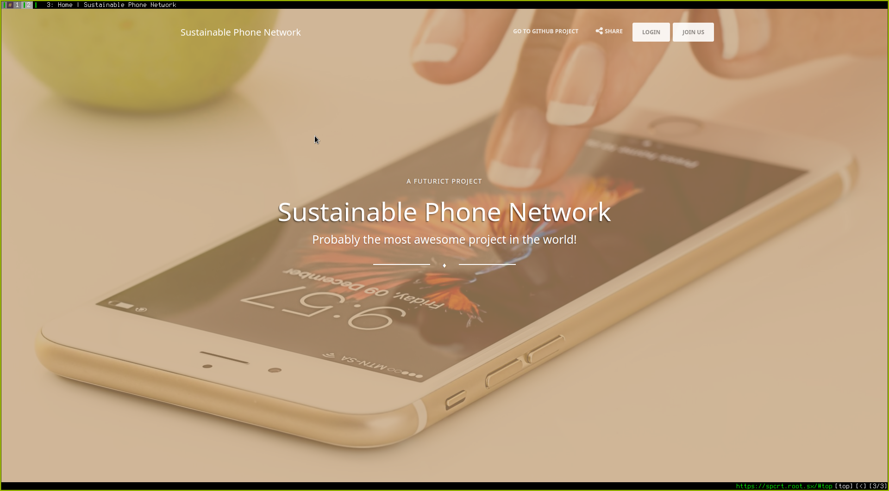
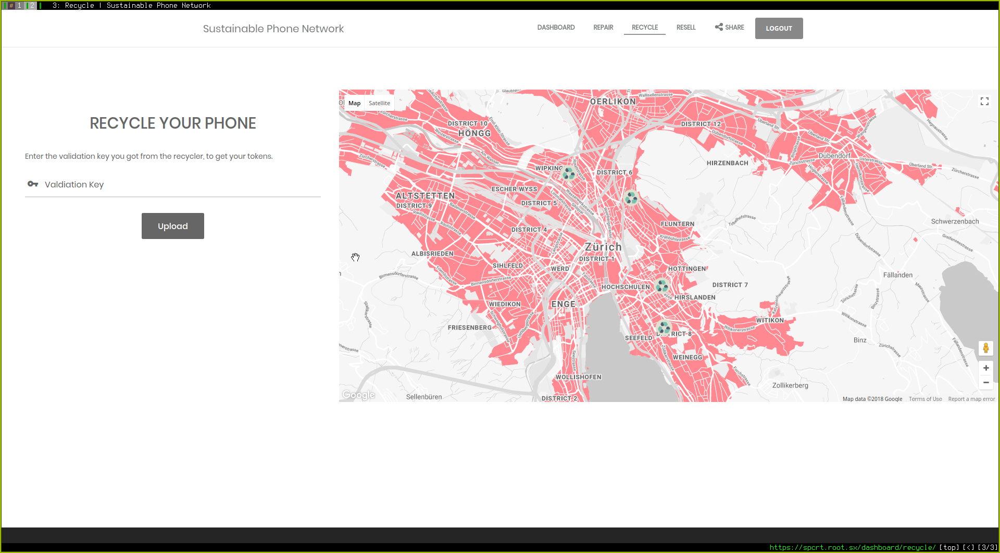
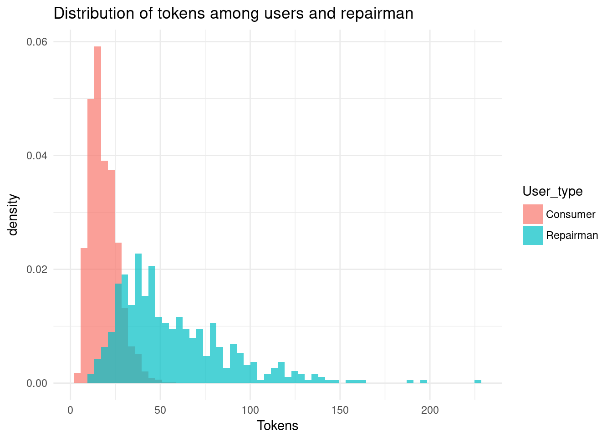

## SPCRT: BIOTS 2018 Hackathon entry

*Online Demo:* https://spcrt.root.sx

This is a Ethereum DAPP created for the BIOTS 2018 hackathon.

(Sorry for the terrible name)

We tried to tackle the problem that mobile phone hardware is often used very unsustainably.
To give people an incentive to repair, recycle and resell phone hardware,
we came up with an ERC20 compatible token system (SPC) to incentivize those actions.

A DAPP using the MetaMask framework was created. You can login with any username/password combination ☺.
There are no external oracles (yet) that check if a phone was __actually__ recycled,
so you can get tokens by using the *recycle* functionality.

The Ethereum smart contract for the demo lives at `0x0bd69bd276d7c0a205cd7096f65b69e14d369214` on the Rinkeby Test Net.

## Team members

- Anja Ulrich
- Raphael Koch
- Benjamin Parellada
- Tomohiro Shibata
- Lukas Tobler
- Philippe Goetschmann

## Screenshots

## Numbers
To obtain optimal costs and gains that maximize the impact of our incentive system we ran simulations to determine the best values for the actions in our system:

